# ERD (ringkas) — skema PostgreSQL 17

Sumber kebenaran: `api/db/migrations/00001…00008`. Semua tabel bisnis memiliki `organization_id` + RLS (`app.organization_id`). ID: UUID v7; business ID: `WO-2026-000001`, `TSK-`, `SR-`, `INC-`, `PM-`, `INS-`, `FND-`, `AST-{CAT}-`.

```mermaid
erDiagram
  organizations ||--o{ users : has
  organizations ||--o{ locations : has
  users ||--o{ user_roles : has
  roles ||--o{ user_roles : grants
  roles ||--o{ role_permissions : has
  teams ||--o{ team_members : has
  users ||--o{ team_members : in
  users ||--o{ sessions : refresh
  users ||--o{ device_tokens : push
  locations ||--o{ locations : parent
  locations ||--o| properties : detail
  locations ||--o| buildings : detail
  locations ||--o| floors : detail
  locations ||--o| units : detail
  tenants ||--o{ units : occupies
  tenants ||--o{ occupants : has
  equipment ||--o{ assets : type
  locations ||--o{ assets : at
  assets ||--o{ qr_codes : qr
  assets ||--o{ maintenance_plans : plan
  maintenance_plans ||--o{ maintenance_schedules : generates
  maintenance_schedules ||--o| work_orders : creates
  checklist_templates ||--o{ checklist_template_items : items
  checklist_templates ||--o{ checklist_runs : snapshot
  checklist_runs ||--o{ checklist_run_items : items
  tasks ||--o{ assignments : "object_type=task"
  work_orders ||--o{ assignments : "object_type=work_order"
  tasks ||--o{ checklist_runs : run
  work_orders ||--o{ checklist_runs : run
  tasks ||--o{ attachments : evidence
  work_orders ||--o{ attachments : evidence
  tasks ||--o{ comments : comment
  work_orders ||--o{ sla_tracking : sla
  service_requests ||--o{ sla_tracking : sla
  sla_policies ||--o{ sla_tracking : policy
  object_links }o--o{ tasks : "from/to"
  object_links }o--o{ work_orders : "from/to"
  object_links }o--o{ service_requests : "from/to"
  object_links }o--o{ incidents : "from/to"
  object_links }o--o{ findings : "from/to"
  patrol_routes ||--o{ patrol_route_checkpoints : order
  checkpoints ||--o{ patrol_route_checkpoints : in
  patrol_routes ||--o{ patrol_schedules : schedule
  tasks ||--o| patrol_tasks : extension
  patrol_tasks ||--o{ checkpoint_scans : scans
  cleaning_schedules ||--o{ cleaning_tasks : generates
  tasks ||--o| cleaning_tasks : extension
  cleaning_tasks ||--o{ housekeeping_inspections : inspected
  tasks ||--o| inspections : extension
  service_request_categories ||--o{ service_requests : category
  tenants ||--o{ service_requests : requester
  notification_rules ||--o{ notifications : produce
  users ||--o{ notifications : inbox
  users ||--o{ notification_preferences : pref
  users ||--o{ sync_mutations : device
  users ||--o{ activities : actor
  users ||--o{ audit_logs : actor
```

## Kelompok tabel
| Migrasi | Tabel |
|---|---|
| 00001 platform | organizations, business_id_sequences, feature_flags, idempotency_keys; role `bv_app`/`bv_worker`; ekstensi ltree, pg_trgm |
| 00002 IAM | users, sessions (refresh token hash, rotasi), roles, permissions, role_permissions, user_roles (role per property, `property_id` NULL = semua), teams, team_members, device_tokens, login_attempts |
| 00003 property | locations (ltree `path`, `location_type`, `code`), properties (timezone, public_intake_key), buildings, towers, floors, areas, spaces, units, tenants, tenant_units, occupants |
| 00004 audit/attachments | activities (timeline per object, `source` web/mobile/system/sync), audit_logs (before/after), attachments (storage_key, gps, status pending/ready), exports |
| 00005 asset | equipment (kategori/tipe), assets (spesifikasi jsonb, criticality), qr_codes |
| 00006 operations | sla_policies, sla_tracking, checklist_templates(+items, versi), tasks, work_orders, incidents, findings, assignments, checklist_runs(+items), comments, object_links |
| 00007 eng/sec/hk | maintenance_plans, maintenance_schedules, inspections, patrol_routes, patrol_route_checkpoints, checkpoints, patrol_schedules, patrol_tasks, checkpoint_scans, cleaning_schedules, cleaning_tasks, housekeeping_inspections |
| 00008 tenant/notif/platform | service_request_categories, service_requests, notification_rules, notifications, notification_preferences, search_documents (tsvector), sync_mutations, sync_cursors |
| 00017 BVRooms | bvrooms_customers (OTP HP, per org), bvrooms_otp_codes, bvrooms_sessions, bvrooms_unit_types (apartemen; `units.bvrooms_unit_type_id` + `rentable_daily`), bvrooms_property_listings (1:1 properties; slug, kategori hotel/apartment, konten, rekening, aturan bayar/batal, agregat rating), bvrooms_property_photos, bvrooms_banners, bvrooms_promotions, bvrooms_addons, bvrooms_bookings (header multi-kamar; kode 12 char), bvrooms_booking_rooms (1:1 hotel_reservations `bvrooms_booking_id`), bvrooms_booking_addons, bvrooms_payments, bvrooms_reviews, bvrooms_wishlists, bvrooms_notifications, bvrooms_push_subscriptions; `hotel_reservations.room_type_id` nullable + `unit_type_id`/`unit_location_id` (EXCLUDE per unit), `hotel_rates.unit_type_id` |

Indeks kunci: `(organization_id, status, due_at)` pada tasks/work_orders; `locations.path` GiST; `search_documents.tsv` GIN + trigram pada judul; unik `(uploaded_by, client_attachment_id)`, `(device_id, client_mutation_id)`.
